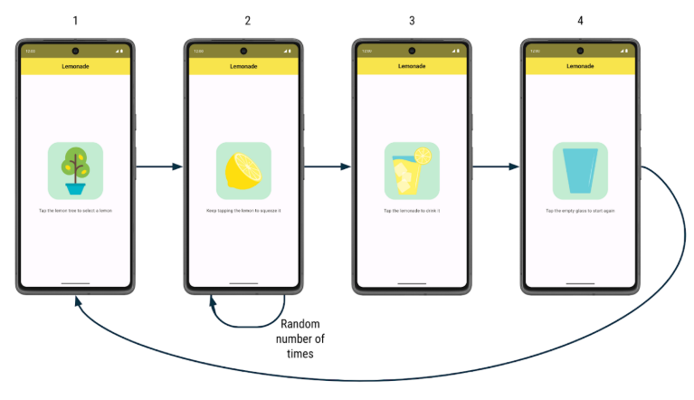

# 🍋 Lemonade App

A simple, interactive app that lets you **make digital lemonade**!  
Tap through the steps to pick lemons, squeeze them, and enjoy a glass of lemonade.  

---

## 🚀 How it works

1. **Pick a lemon** 🍋  
   - When the app launches, you see a **lemon tree**.  
   - Tap the tree to select a lemon.  

2. **Squeeze the lemon** ✋  
   - After tapping the tree, a lemon appears.  
   - Tap it **2–4 times** (random each round) to squeeze the juice.  

3. **Enjoy your lemonade** 🥤  
   - Once squeezed, you’ll see a **glass of lemonade**.  
   - Tap the glass to drink it.  

4. **Start again** 🔄  
   - After drinking, an **empty glass** appears.  
   - Tap it to go back to the lemon tree and repeat the process.  

---

## 📸 Screenshots

---

## 🛠️ Implementation details

- Each step shows a **different image and text label**.  
- Tapping the UI element updates the app state and moves to the next step.  
- The number of taps required to squeeze the lemon is chosen randomly (between 2 and 4).  

---

## 🎯 Goal

Your job is to:  
- Build the app’s **UI layout**.  
- Implement the **logic** for progressing through all the steps of making lemonade.  

---

💡 Consider this project as a metaphor… or just a fun way to pass the time! 😄
